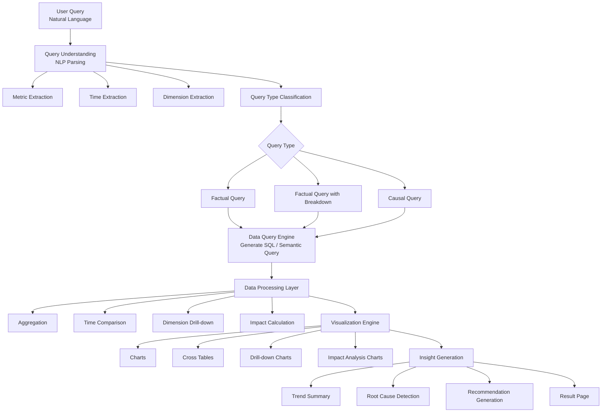

**AI Performance Insight Assistant**

The goal of this system is to allow users to ask business questions about performance metrics in natural language, automatically translate the question into structured metrics using NLP, retrieve relevant data, visualize the results, and explain the factors behind performance changes.

**Natural Language Query + Semantic Data Layer + Automated Analytics = Conversational BI**

**How It Works**

**1. User Submits a Natural Language Query**
Users ask questions directly in natural language, such as:
“What product had the highest profit margin in Q3?”
“Show me the cost breakdown by region for 2023.”
“Why did our revenue drop last month?”
The system parses the query to identify:
the metric (e.g., revenue, profit margin)
the time range (e.g., Q3, last month)
the dimension (e.g., product, region)
the query intent (fact query, breakdown analysis, or causal analysis)

**2. Query Classification**
Based on the parsed information, the system classifies the query into one of three types:
Factual Query – retrieves and visualizes a metric.
Breakdown Query – analyzes the metric across a specific dimension.
Causal Query – investigates reasons for changes in a metric.
This classification determines how the result page will be structured.

**3. Data Retrieval and Analysis**
The system converts the parsed query into structured data queries through the semantic data layer.
It then performs automated analytics including:
metric aggregation
time-based comparison
dimension breakdown
impact analysis
For causal queries, the system compares the selected time period with the previous comparable period to identify changes.

**4. Visualization and Exploration**
The results are presented through dynamic visualizations, including:
charts showing metric trends
dimension breakdown charts
pivot tables for time comparison
horizontal bar charts for impact analysis
Users can further explore the data through dimension drill-down, which allows them to analyze metrics at more detailed levels of the dimension hierarchy.
Example hierarchy:
Product Category
Product Subcategory
Material Code
SKU

**5. Insight Generation**
For causal queries, the system generates additional analytical insights, including:
explanation of metric changes
identification of key contributing factors
recommendations for potential improvements
These insights help users quickly understand why a metric changed and what actions can be taken.

**6. Interactive Drill-down Analysis**
Users can perform additional analysis by right-clicking on chart values and selecting Dimension Drill-down.
The system then displays detailed breakdown results in a new chart section, allowing users to explore the data at finer levels of granularity.

**AI Data Analysis Flow**

